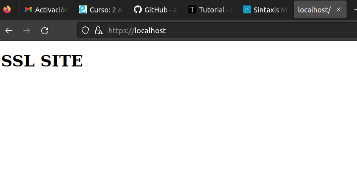

# Habilitar HTTPS

Para habilitar el HTTPS en el servidor apache tenemos que serguir los siguientes pasos:

- Instalar los paquetes necesarios:
    - openssl
- Configurar el ssl
- Crear la clave privada
- Configurar fichero snecesarios
- Reiniciar el servicio apache
## SSL
 Habilitamos el módulo apache del mod_ssl:
    - Attach shell en el contenedor del apache
    - Instalamos paquete ssl
    - Habilitamos el siguiente módulo :
        -a2enmod ssl
Con esto habremos creado y habilitado los modulos con los archivos del ssl.

**Certificados**

Debemos crear una clave privada y el certificado del sitio web mediante el comando del OpenSSl

- Primero creamos una carpeta a la que llamamos certificados.
- Nos situamos en dicha carpeta
- Ejecutamos el comando de openssl con todas las especificaciones necesarias del comando para crear la clave.
- Introducimos la información solicitada, especificando en el common_name fabulas.com

Una vez creada esta clave, nos habrá generado dos archivos cifrados en la carpeta de certificados.

Ahora nos queda editar el archivo de configuración de Apche para el sitio web predeterminado.

    - En el contendor apache habilitamos el sitio ssl:
        -a2ensite ssl
    - Una vez habilitado procedemos a editar el archivo default-ssl:
        - Le debemos modificar la ruta del SSLCERTIFICATE.. y escribirle la ruta donde tenemos nuestros archivos cifrados en la carpeta de certificados.

Como el puerto 443 lo escucha por defecto si está activado el módulo de ssl no debemos hacer nada más.

***Ahora solo nos queda reiniciar el servicio de Apache.***

Como podemos ver, funciona correctamente.

